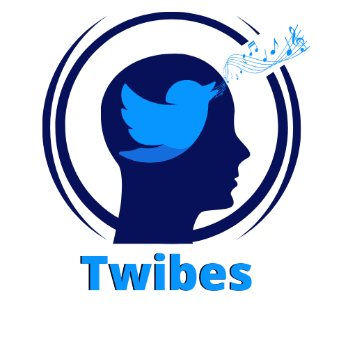

# Twibes - *the vibes we share*

## About Twibes
 

### What is Twibes?
 

Twibes is a web application that allows you to uplift your mental health with the help of music therapy.

Twibes analyzes your social media activity on Twitter to understand how positive or negative the content you share is and accordingly using Spotify's recommendation system to deliver music that will help uplift your mood.
 
 

### Why the world needs Twibes
 

**The year 2020 has not been the best year for most of our community.** Whether we consider the Black Lives Matter protests in response to the killing of George Floyd and several other incidents, the Delhi Riots that occurred due to protests against the Citizenship Amendment Act in India, the End SARS movement in response to police brutality in Nigeria, or the COVID-19 pandemic which affected folks across the world or any other major issue, the year has definitely taken a toll on all of our health.

While a lot of us can cope with taking care of our physical health, most people are not well equipped to manage their mental health. A major reason for this is that there is a lot of stigma revolving around discussions of mental health in most parts of the world. That combined with the lack of education on mental health, **most people are either unaware of or reject the existence of mental health issues**.

Ever since the pandemic began, we have been restricted to the confines of our homes, limiting our interactions with our peers and acquaintances in the outside world. This has made it difficult for most people to find "safe spaces" where they can be themselves without any external worry. Due to this, one of the most convenient platforms for people to express is social media. **Social media is a great platform to quickly spread awareness** about different matters, **however it can promote as well as reinforce certain ideas or perspectives in peoples' minds, some of which may be highly detrimental**.

In this huge crisis around mental health, **we want to give people a chance to take their first steps in comfortable tracking the status of their mental health and heal it using** one of our favourite means, **music**. Music therapy is an evidence-based clinical use of musical interventions to improve peoples' quality of life that has existed for thousands of years. With this solution, **we look forward to enabling people all around the world to develop a habit of tracking their own mental health and care better for themselves**.
 
 

### Prospective Revenue Model for Twibes
 

For the time-being, all features in Twibes are available to test for free. However, when we launch this product in the market, we believe that the best revenue model for our product is a ***freemium model***.

The differences in the **Free** and **Premium** models are stated below:

| | Free | Premium |
| - | - | - |
| Cost | No charge | $10 / month |
| Uses per Month | 5 | No limit |
| Tweets analyzed at a time | Last 30 tweets | Entire Twitter History |
| Therapy chatbot | ✔ | ✔ |

*Need to add more points here*
 
 

### What's next for Twibes
 

We have several functionalities that we intend to implement in Twibes in the near future:
 

* Adding support for other social media platforms
* Functionality to connect Premium users with therapists

*Need to add more points here*
 

---

## Developing Twibes
 

### How we built Twibes
 

The tech stack used to create **Twibes** is as follows:

* The web app has been built using **Flask**
* The web app has been deployed using **Azure App Service**
* The front end of the web app has been built using **HTML**, **CSS**, and **Bootstrap**
* The login and social media data has been obtained using the **Twitter API**
* The music playlists based on the user's sentiment are generated using the **Spotify API**

 

*Need to add more points here*
 
 

### Features that Twibes covers
 

We have various features in the platform 
 
 

### Challenges that we faced in the process
 

* *Need to add more points here*
 

### Accomplishments that we're proud of
 

* *Need to add more points here*

---

## The Team Behind Twibes
 

|  |  |  |  |  |
| - | - | - | - | - |
| Anush Krishna V | Aanisha Bhattacharyya | Victor Dorado Javier | Onajite Taire | Aditya Oberai |
| [@Anush_krishna_v](https://twitter.com/Anush_krishna_v) | [@AanishaBhattac2](https://twitter.com/AanishaBhattac2) | [@TheVidoja](https://twitter.com/TheVidoja) | [@wonataire](https://twitter.com/wonataire) | [@adityaoberai1](https://twitter.com/adityaoberai1) |